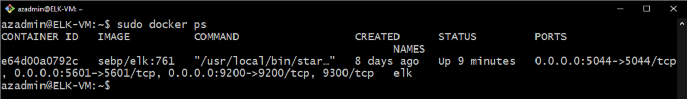

## Automated ELK Stack Deployment

The files in this repository were used to configure the network depicted below.

These files have been tested and used to generate a live ELK deployment on Azure. They can be used to either recreate the entire deployment pictured above. Alternatively, select portions of the playbook file may be used to install only certain pieces of it, such as Filebeat.

  - [Playbook File: DVMA](https://github.com/david-santoso/ELK-Stack-Project/blob/main/Ansible/install-dvma.yml)
  - [Playbook File: ELK](https://github.com/david-santoso/ELK-Stack-Project/blob/main/Ansible/install-elk.yml)
  - [Playbook File: Filebeat](https://github.com/david-santoso/ELK-Stack-Project/blob/main/Ansible/filebeat-playbook.yml)
  - [Config File: Filebeat]
  - [Playbook File: Metricbeat](https://github.com/david-santoso/ELK-Stack-Project/blob/main/Ansible/metricbeat-playbook.yml)
  - [Config File: Metricbeat]

This document contains the following details:
- Description of the Topology
- Access Policies
- ELK Configuration
  - Beats in Use
  - Machines Being Monitored
- How to Use the Ansible Build

### Description of the Topology

The main purpose of this network is to expose a load-balanced and monitored instance of DVWA, the D*mn Vulnerable Web Application.

Load balancing ensures that the application will be highly available, in addition to restricting access to the network.

Integrating an ELK server allows users to easily monitor the vulnerable VMs for suspicious changes to the file system and system metrics such as CPU usage and uptime.

The configuration details of each machine may be found below.

|      Name     |    Function   |   IP Address   | Operating System |
|:-------------:|---------------|----------------|------------------|
| Jump Box      | Gateway       |    10.0.0.5    |      Linux       |
| Web-1 VM      | Web Server    |    10.0.0.7    |      Linux       |
| Web-2 VM      | Web Server    |    10.0.0.6    |      Linux       |
| ELK VM        | ELK Server    |    10.2.0.4    |      Linux       |

### Access Policies

The machines on the internal network are not exposed to the public Internet. 

Only the Jump Box machine can accept SSH connections from the Internet. Access to this machine is only allowed from my Personal Public IP address (Personal PIP).

Virtual Machines within the network (Web-1, Web-2, and ELK VM) can only be accessed via SSH by the ansible docker container running on the Jump Box machine (10.0.0.5). The DVMA and Kibana can only be accessed from my Personal PIP through HTTP port 80 and 5601, respectively.

A summary of the access policies in place can be found in the table below.

| Name          | Publicly Accessible | Allowed IP Addresses                           |
|---------------|---------------------|------------------------------------------------|
| Jump Box      | Yes                 | Personal PIP                                   |
| Load Balancer | Yes                 | Personal PIP                                   |
| Web-1 VM      | No                  | 10.0.0.5                                       |
| Web-2 VM      | No                  | 10.0.0.5                                       |
| ELK VM        | Yes                 | Personal PIP, 10.0.0.5, 10.0.0.6, 10.0.0.7  |

### Elk Configuration

Ansible was used to automate configuration of the ELK machine. No configuration was performed manually, which is advantageous because it drastically reduces the potential for human error and make it easy to configure potentially thousands of identical machines all at once. It allows network administrator to clearly build in security protocols from the ground up so if the machine is found to be vulnerable, it's easy to change the code and build in a fix. The  automation also allows every change to machine configuration to be documented, logged, and tracked.

The install-elk playbook implements the following tasks:
- Install docker.io and python3-pip apt packages
- Install docker pip packages
- Configure the virtual memory size
- Download and launch a docker elk container image
- Starts the container and enable service docker on boot

The following screenshot displays the result of running `docker ps` after successfully configuring the ELK instance.

### Target Machines & Beats
This ELK server is configured to monitor the following machines:
- _TODO: List the IP addresses of the machines you are monitoring_

We have installed the following Beats on these machines:
- _TODO: Specify which Beats you successfully installed_

These Beats allow us to collect the following information from each machine:
- _TODO: In 1-2 sentences, explain what kind of data each beat collects, and provide 1 example of what you expect to see. E.g., `Winlogbeat` collects Windows logs, which we use to track user logon events, etc._

### Using the Playbook
In order to use the playbook, you will need to have an Ansible control node already configured. Assuming you have such a control node provisioned: 

SSH into the control node and follow the steps below:
- Copy the _____ file to _____.
- Update the _____ file to include...
- Run the playbook, and navigate to ____ to check that the installation worked as expected.

_TODO: Answer the following questions to fill in the blanks:_
- _Which file is the playbook? Where do you copy it?_
- _Which file do you update to make Ansible run the playbook on a specific machine? How do I specify which machine to install the ELK server on versus which to install Filebeat on?_
- _Which URL do you navigate to in order to check that the ELK server is running?

_As a **Bonus**, provide the specific commands the user will need to run to download the playbook, update the files, etc._
