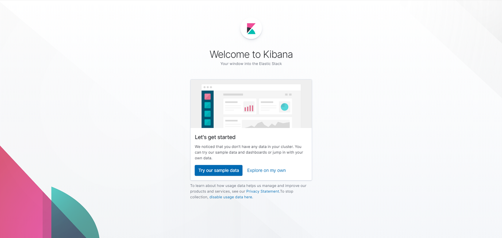
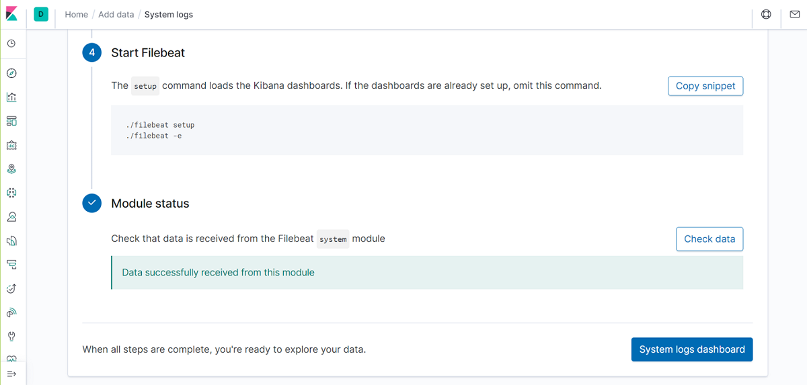
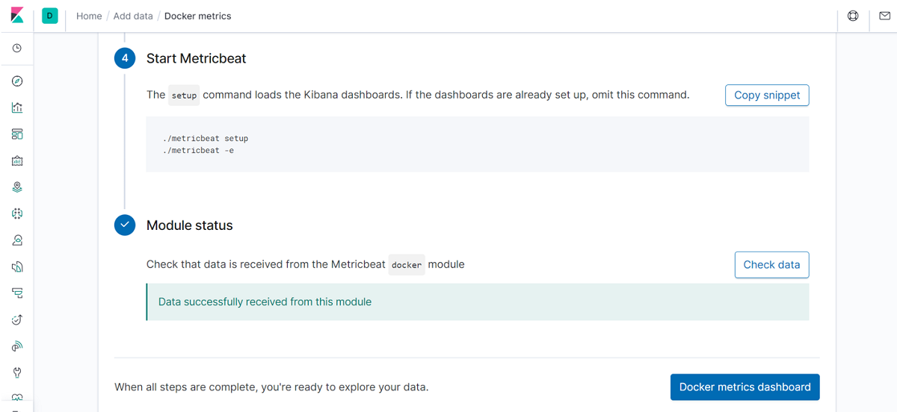

## Automated ELK Stack Deployment

The files in this repository were used to configure the network depicted below.


These files have been tested and used to generate a live ELK deployment on Azure. They can be used to either recreate the entire deployment pictured above, or alternatively, select portions of the playbook file to install only certain pieces of it, such as Filebeat.

- [Playbook File: install-dvma.yml](Ansible/install-dvma.yml)
- [Playbook File: install-elk.yml](Ansible/install-elk.yml)
- [Playbook File: filebeat-playbook.yml](Ansible/filebeat-playbook.yml)
- [Config File: filebeat-config.yml](Ansible/filebeat-config.yml)
- [Playbook File: metricbeat-playbook.yml](Ansible/metricbeat-playbook.yml)
- [Config File: metricbeat-config.yml](Ansible/metricbeat-config.yml)

This document contains the following details:
- Description of the Topology
- Access Policies
- ELK Configuration
  - Beats in Use
  - Machines Being Monitored
- How to Use the Ansible Build


### Description of the Topology

The main purpose of this network is to expose a load-balanced and monitored instance of DVWA, the D*mn Vulnerable Web Application.

Load balancing ensures that the application will be highly available, in addition to restricting access to the network.

Integrating an ELK server allows users to easily monitor the vulnerable VMs for suspicious changes to the file system and system metrics such as CPU usage and uptime.

The configuration details of each machine may be found below.

|      Name     |    Function   |   IP Address   | Operating System |
|:-------------:|---------------|----------------|------------------|
| Jump Box      | Gateway       |    10.0.0.5    |      Linux       |
| Web-1 VM      | Web Server    |    10.0.0.7    |      Linux       |
| Web-2 VM      | Web Server    |    10.0.0.6    |      Linux       |
| ELK VM        | ELK Server    |    10.2.0.4    |      Linux       |

### Access Policies

The machines on the internal network are not exposed to the public Internet. 

Only the Jump Box machine can accept SSH connections from the Internet. Access to this machine is only allowed from my Personal Public IP address (Personal PIP).

Virtual Machines within the network (Web-1, Web-2, and ELK VM) can only be accessed via SSH by the ansible docker container running on the Jump Box machine (10.0.0.5). The DVMA and Kibana can only be accessed from my Personal PIP through HTTP port 80 and 5601, respectively.

A summary of the access policies in place can be found in the table below.

| Name          | Publicly Accessible | Allowed IP Addresses                           |
|---------------|---------------------|------------------------------------------------|
| Jump Box      | Yes                 | Personal PIP                                   |
| Load Balancer | Yes                 | Personal PIP                                   |
| Web-1 VM      | No                  | 10.0.0.5                                       |
| Web-2 VM      | No                  | 10.0.0.5                                       |
| ELK VM        | Yes                 | Personal PIP, 10.0.0.5,<br>10.0.0.6, 10.0.0.7  |


### Elk Configuration

Ansible was used to automate configuration of the ELK machine. No configuration was performed manually, which is advantageous because it drastically reduces the potential for human error and make it easy to configure potentially thousands of identical machines all at once. It allows network administrator to clearly build in security protocols from the ground up so if the machine is found to be vulnerable, it's easy to change the code and build in a fix. The  automation also allows every change to machine configuration to be documented, logged, and tracked.

The install-elk playbook implements the following tasks:
- Install docker.io and python3-pip apt packages
- Install docker pip packages
- Configure the virtual memory size
- Download and launch a docker elk container image
- Starts the container and enable service docker on boot

The following screenshot displays the result of running `docker ps` after successfully configuring the ELK instance.


### Target Machines & Beats
This ELK server is configured to monitor the following machines:
- Web-1 VM (10.0.0.7)
- Web-2 VM (10.0.0.6)

We have installed the following Beats on these machines:
- Filebeat
- Metricbeat

These Beats allow us to collect the following information from each machine:

- `Filebeat` is used to collect log files from very specific files, such as logs generated by Apache, Microsoft Azure tools, the Nginx web server, or MySQL databases. The log files are then forwarded to either Logstash for more advanced processing or directly into Elasticsearch for indexing. Example: /var/log/*.log files.

- `Metricbeat` monitors the behaviour and usage of system resources, which helps increase the availability and reliability of the system and allows IT teams to quickly respond to any fault if they occour. Example: CPU or memory statistics.


### Using the Playbook
In order to use the playbook, you will need to have an Ansible control node already configured. Assuming you have such a control node provisioned: 

#### Installing ELK Server

SSH into the control node and follow the steps below:
- Copy the `install-elk.yml` file to /etc/ansible directory.
- Update the Ansible's configuration and inventory file to include the ELK server's user name and private IP address, respectively. Don't forget to specify python3 in the hosts file as shown below:

```
[elk]
10.2.0.4 ansible_python_interpreter=/usr/bin/python3
```

- Run the playbook, and navigate to `http://[ELK-VM Public IP]:5601/app/kibana` to check that the installation worked as expected. If successful, you will see the Kibana's welcome page as shown below:




#### Installing Filebeat

Since Filebeat is built to collect data about specific files on remote machines, it must be installed on the VMs you want to monitor. In this example, the Filebeat will be installed on the Web-1 and Web-2 VMs to monitor the Apache server and MySQL database logs generated by DVWA.

SSH into the control node and follow the steps below:
- Copy the `filebeat-playbook.yml` file to /etc/ansible/roles directory.
- Copy the `filebeat-config.yml` file to  /etc/ansible/files directory.
- Edit the filebeat configuration file as specified below:
    - Scroll to line #1105 and replace the IP address with the IP address of your ELK machine, but do not change the default port number (9200).
    - Similarly, scroll to line #1805 and replace the IP address with the IP address of your ELK machine, but do not change the default port number (5601).
    - Note that the default credentials are elastic:changeme and should not be changed.
- After editing the configuration file, run the `filebeat-playbook.yml` playbook file using the command below:
    - `ansible-playbook filebeat-playbook.yml`

- To check if the installation is successful, do the following steps on Kibana page (http://[ELK-VM Public IP]:5601/app/kibana):
    - From the welcome page, click **Explore on my Own**.
    - Click **Add Log Data**.
    - Choose **System Logs**.
    - Click on the **DEB** tab under **Getting Started**.
    - Scroll down to **Step 5: Module Status** and click **Check Data**.
    - Scroll to the bottom of the page and click **Verify Incoming Data**.
    - If installation was successful, you will see a message *Data successfully received from this module* as shown below. Click **System logs dashboard** to open Filebeat System dashboard.
	




#### Installing Metricbeat

Similar to Filebeat, Metricbeat must be installed on the VMs you want to monitor. In this example, it will be installed on the Web-1 and Web-2 VMs to monitor the behaviour and usage of system resources.

SSH into the control node and follow the steps below:
- Copy the `metricbeat-playbook.yml` file to /etc/ansible/roles directory.
- Copy the `metricbeat-config.yml` file to  /etc/ansible/files directory.
- Edit the metricbeat configuration file as specified below:
    - Scroll to line #62 and replace the IP address with the IP address of your ELK machine, but do not change the default port number (5601).
    - Similarly, scroll to line #96 and replace the IP address with the IP address of your ELK machine, but do not change the default port number (9200).
    - Note that the default credentials are elastic:changeme and should not be changed.
- After editing the configuration file, run the `metricbeat-playbook.yml` playbook file using the command below:
    - `ansible-playbook metricbeat-playbook.yml`
- To check if the installation is successful, do the following steps on Kibana page (http://[ELK-VM Public IP]:5601/app/kibana):
    - Click **Add Metric Data**.
    - Choose **Docker Metrics**.
    - Click on the **DEB** tab under **Getting Started**.
    - Scroll down to **Step 5: Module Status** and click **Check Data**.
    - Scroll to the bottom of the page and click **Verify Incoming Data**.
    - If installation was successful, you will see a message *Data successfully received from this module* as shown below. Click **System logs dashboard** to open Metric System dashboard.




